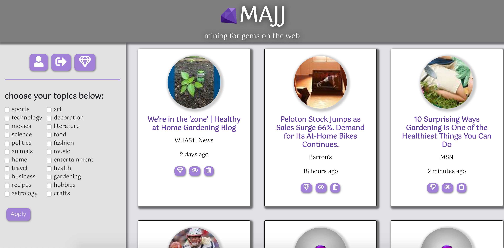
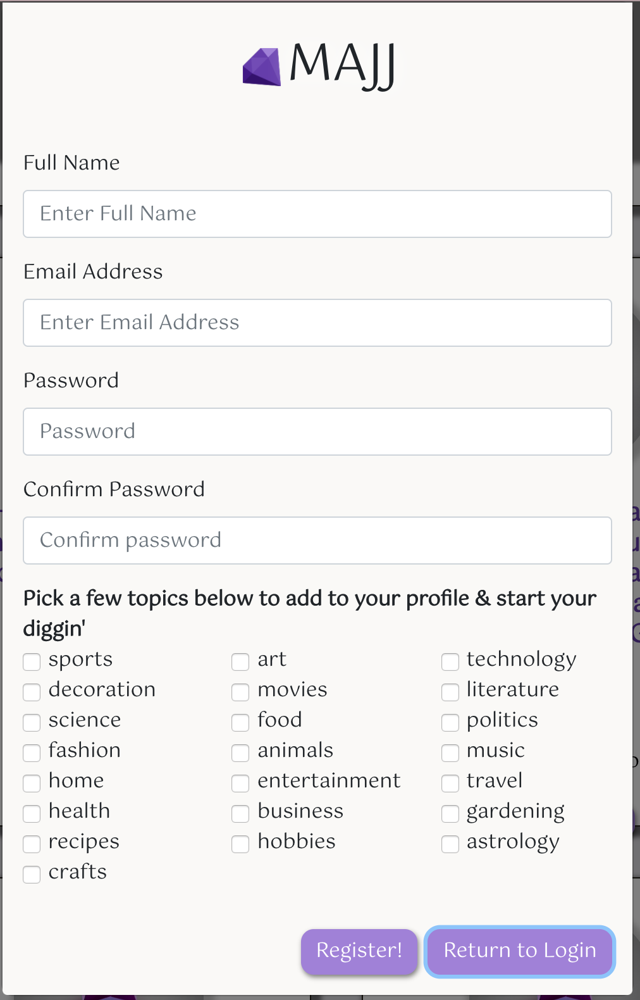

# MAJJ

A React-based Web Application

## User Story

- AS A user wanting to stay up to date on the topics that interest me,
- I WANT to be able to view the most recent news and content relevant to my interests and save these articles in a single location,
- SO THAT I can read the stories I've saved at my leisure.

## Overview

MAJJ is a web application that serves the user fresh content from thousands of providers, presenting the ability to conveniently view and save articles for your reading pleasure. In the event that you’re unable to view content in the moment or find content but want to save it for later use, MAJJ allows you to create your own profile, filter through content based on your interests and save this content and your interests all in a single location for you to re-visit whenever you please. MAJJ is creating a more convenient user experience; producing one place to save and view articles from thousands of providers, stripping the burden of scouring the web yourself!

It utilizes a MonogoDB to store users profile along with their saved content, Reactjs to render, dynamically respond and adjust content based on filter and user, axios for AJAX calls to get, pull and push data from the Bing News Search API and our database, Node.js for back-end, Express.js for routing and React-Bootstrap along with MaterialUI for an easy to use modern, and clean user interface.

## Utilizing the App

- Experience the deployed app: [Here](https://www.majj.app "Here")
- Upon entering the app, the user will be served a limited amount of content from all topics.
- If the user wants to filter based on a specific topic, the user can click the checkboxes provided; click "Apply" and search through content on MAJJ.
- If the user finds content they want to save, the user MUST create a profile in order to save this content or "gem".
- The user can click the "Profile" icon button, then "Sign Up", and MAJJ will prompt the user to fill out their information along with their filter and click "Register".
- To save a "gem" to the users profile, the user will click the "gem" icon on that specific content. The content will then be put into the users "Saved Gems" list which they can view by clicking the larger Gem icon. The content will also be removed from the page and new content will render.
- If the user is uninterested in a specific article, the user can click "Trash" icon on that specific content to delete it from view and new content will render.
- When the user is signed-in they can save an unlimited amount of "gems" to their "Saved Gems" list. This will save into MAJJ's database so when the user logs out their "Saved Gems" will always be stored.
- If the user already created a profile with MAJJ, they can log-in and view their "Saved Gems".
- When the user is done using MAJJ, they can sign out which returns MAJJ to its default state of truly randomized content.

## Demonstrations

## Landing Page:

## Mine for Gems:

## Filter Through Articles and Save Gems:

## New User Registration Sign Up:

## Tech used

- Reactjs
- HTML/CSS
- Reactjs Bootstrap
- MaterialUI
- Javascript/JSX
- Bing News Search API
- Node.js
- MongoDB
- NPM packages including:
  - axios
  - express
  - animate.css
  - mongoose
  - passport
  - passport-local
  - validator
  - bcryptjs
  - react-snackbar-toast
  - react-moment
  - react-router

## Contributers

- **Max Kulicke** - _Full-Stack Development_ - [Max Kulicke](https://github.com/maxkulicke "Max Kulicke")
- **Alyssa Cucunato** - _Full-Stack Development_ - [Alyssa Cucunato](https://github.com/acucunato "Alyssa Cucunato")
- **Jordan Smith** - _Full-Stack Development_ - [Jordan Smith](https://github.com/jsmithxyz "Jordan Smith")
- **James McKenna** - _Full-Stack Development_ - [James McKenna](https://github.com/jpmckenna90 "James McKenna")
